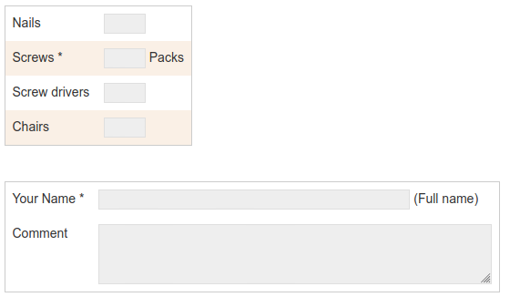

# DokuWiki-Plugin: Order Items

A variant of a form generator which is intended for creating lists in a table. Each row containing an item name and a input box for entering the number of
 this item to be ordered. An email adress can be stated to which the order is sent.



## Compatibility

* Tested with DokuWiki/**Hogfather**
* Tested with PHP **7.2**

## Usage

Use the ``<orderitem> ... </orderitem>`` tags to create a list.

Every line represents an item which is displayed in the list. The unit can be stated at the end, separated by ``##`` from the preceeding text. A default value can be set by another ``##`` 
after the unit (which can be left empty).

Additional keyword can be used at the **beginning** of a line.

* ``id`` - Adds additional input field for an article no. Must be stated before other prefixes.
* ``mail [email]`` - states the email to where the form information is to be sent. Comma separation of multiple E-Mails possible
* ``space`` - creates a space (in form of a new table) between the data
* ``text [item name]`` - displays a larger input box
* ``box [item name]`` - displays a textarea
* ``hidden [text]`` - additional text which is not display but sent per email
* ``!!`` at the **end** of a line indicate that a field is mandatory

### Example

```
<orderitem>
mail test@example.com

A simple item
Another item ## Unit

space

id Another simple item ## ## 10
And again ## cm ## 20 !!
text Name ## Name !!

box whatever

hidden This text will be sent additionally
hidden For example: customer number

</orderitem>
```
